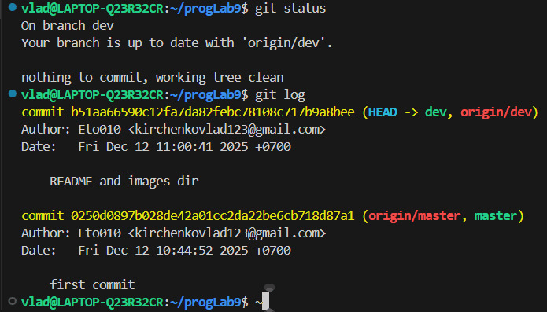

**Оценка 3:**

1, 2.

3, 4.
``` On branch dev
Your branch is up to date with 'origin/dev'.

Changes not staged for commit:
  (use "git add <file>..." to update what will be committed)
  (use "git restore <file>..." to discard changes in working directory)
        modified:   README.md

Untracked files:
  (use "git add <file>..." to include in what will be committed)
        images/
        sort.c   
```
5, 6.
``` On branch dev
Your branch is up to date with 'origin/dev'.

Changes to be committed:
  (use "git restore --staged <file>..." to unstage)
        modified:   README.md
        new file:   images/capture_20251212111046357.png
        new file:   sort.c
````
7, 8 
``` On branch dev
Your branch is ahead of 'origin/dev' by 1 commit.
  (use "git push" to publish your local commits)

nothing to commit, working tree clean
```
9, 10.
```
 On branch dev
Your branch is ahead of 'origin/dev' by 1 commit.
  (use "git push" to publish your local commits)

Changes not staged for commit:
  (use "git add <file>..." to update what will be committed)
  (use "git restore <file>..." to discard changes in working directory)
        modified:   sort.c

no changes added to commit (use "git add" and/or "git commit -a")
```
11, 12.
```
On branch dev
Your branch is ahead of 'origin/dev' by 1 commit.
  (use "git push" to publish your local commits)

Changes to be committed:
  (use "git restore --staged <file>..." to unstage)
        modified:   sort.c
```
13, 14, 15. 
``` 
On branch dev
Your branch is ahead of 'origin/dev' by 2 commits.
  (use "git push" to publish your local commits)

Changes not staged for commit:
  (use "git add <file>..." to update what will be committed)
  (use "git restore <file>..." to discard changes in working directory)
        modified:   sort.c

no changes added to commit (use "git add" and/or "git commit -a")
```
Теперь поиграемся с ветками:

1, 2:
```
* dev
  master
  mybranch
```
3, 4
```
vlad@LAPTOP-Q23R32CR:~/progLab9$ git status
On branch dev
Your branch is ahead of 'origin/dev' by 1 commit.
  (use "git push" to publish your local commits)

nothing to commit, working tree clean
vlad@LAPTOP-Q23R32CR:~/progLab9$ git branch mybranch
fatal: a branch named 'mybranch' already exists
vlad@LAPTOP-Q23R32CR:~/progLab9$ git switch mybranch
Switched to branch 'mybranch'
vlad@LAPTOP-Q23R32CR:~/progLab9$ git status
On branch mybranch
nothing to commit, working tree clean
vlad@LAPTOP-Q23R32CR:~/progLab9$ 
```
5, 6, 7, 8.
```
git log --oneline --graph
* 3a43ac5 (HEAD -> mybranch) file1
* 0655ca7 (origin/dev) end 3
* 4319db2 error commit
* 2e606d8 sort
* b51aa66 README and images dir
* 0250d08 (origin/master, master) first commit
```
9, 10.
```
git log --oneline --graph
* 0250d08 (HEAD -> master, origin/master) first commit
```
11, 12, 13. 
```
git log --oneline --graph
* eca4d80 (HEAD -> master) switch to mybranch
* 0250d08 (origin/master) first commit
vlad@LAPTOP-Q23R32CR:~/progLab9$ git switch mybranch
Switched to branch 'mybranch'
vlad@LAPTOP-Q23R32CR:~/progLab9$ git log --oneline --graph
* 3a43ac5 (HEAD -> mybranch) file1
* 0655ca7 (origin/dev) end 3
* 4319db2 error commit
* 2e606d8 sort
* b51aa66 README and images dir
* 0250d08 (origin/master) first commit
```
14. Да, file2.txt не существует в ветке mybranch

